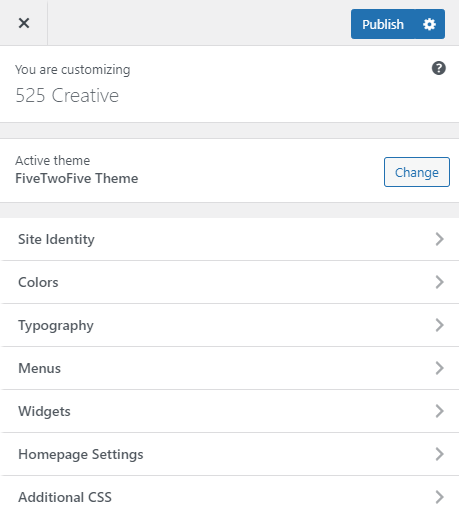
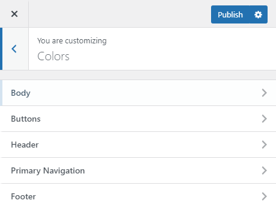
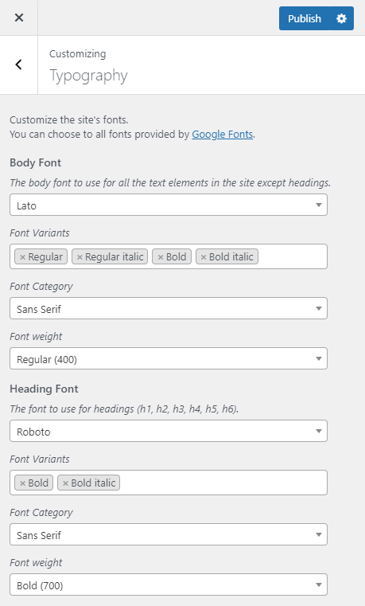

FiveTwoFive Theme
========

FiveTwoFive Theme is a meant to be used as a parent theme for any client projects of fivetwofive creative.

## Features


- Theme options - easily customize the site colors and typography.
- Modules template - create pages with ease and flexibility
- Responsive design - automatically adjust for different screen sizes and viewports.
- Bootstrap - quickly design and customize responsive mobile-first sites
- Task runner - automate slow, repetitive workflows and compose them into efficient build pipelines.

## Getting Started

Set up the theme options by going to `Appearance -> Customize`.  
These are all global configurations for the site, some modules do let you change it's content styles for more flexibility.



### Colors



Change the theme colors to your liking, the site will reload for the preview.  
The colors section contains color picker fields where you can change the color of the component it's label to.

### Typography



The typography section have the following fields:

**Body Font** - the font to apply on all text elements except headings. default: DM Sans

**Heading Font** - the font to apply on all headings.

**Font Variants** - sets how thick or thin characters in text should be displayed, these fields also have two font styles to choose from regular or italic.

**Font Category** - define what font category the chosen body or heading font belongs to.

**Font Weight** - select what the specific font weight you want to use to the body or heading font.

## Hooks and Filters

### Change the default selected values in the theme customizer.
Add a filter to `fivetwofive_theme_default_theme_mods` to change the default selected values 
in the theme customizer.

In this example we want to change the default background color of the body.

```php
/**
 * Change the default background color of the theme customizer.
 *
 * @param array $default_theme_mods Default Theme mods.
 * @return array $default_theme_mods Default Theme mods.
 */
function fivetwofive_theme_default_theme_mods_override( $default_theme_mods ) {

  // Below are the default theme mods key and value.
  // array(
  //   'site_identity_hide_blogname'          => '',
  //   'site_identity_hide_blogdescription'   => '',
  //   'colors_body_background_color'         => '#ffffff',
  //   'colors_body_text_color'               => '#444444',
  //   'colors_body_heading_color'            => '#444444',
  //   'colors_body_link_color'               => '#444444',
  //   'colors_body_link_color_hover'         => '#ffcb05',
  //   'colors_body_link_color_visited'       => '#444444',
  //   'colors_button_text_color'             => '#444444',
  //   'colors_button_text_color_hover'       => '#FFCB05',
  //   'colors_button_background_color'       => '#FFCB05',
  //   'colors_button_background_color_hover' => '#444444',
  //   'colors_button_border_color'           => '#FFCB05',
  //   'colors_button_border_color_hover'     => '#444444',
  //   'colors_header_background_color'       => '#ffffff',
  //   'colors_primary_navigation_background_color' => '#ffffff',
  //   'colors_primary_navigation_link_color' => '#444444',
  //   'colors_primary_navigation_active_link_color' => '#FFCB05',
  //   'colors_footer_background_color'       => '#ffffff',
  //   'colors_footer_text_color'             => '#000000',
  //   'typography_body_font'                 => 'DM Sans',
  //   'typography_body_font_variants'        => array( '400', 'italic' ),
  //   'typography_body_font_category'        => 'sans-serif',
  //   'typography_body_font_weight'          => '400',
  //   'typography_heading_font'              => 'Roboto',
  //   'typography_heading_font_variants'     => array( '700', '700italic' ),
  //   'typography_heading_font_category'     => 'sans-serif',
  //   'typography_heading_font_weight'       => '700',
  // );

	$default_theme_mods['colors_body_background_color'] = '#eeeeee';

	return $default_theme_mods;
}
add_filter( 'fivetwofive_theme_default_theme_mods', 'fivetwofive_theme_default_theme_mods_override' );
```

## Layout
Change the default layout of the theme through these filters.

### Enable / Disabled sidebar to a page
Add a filter to `fivetwofive_theme_enable_sidebar` to make a specific page have the sidebar
enabled. By default blog page, archive pages, and single post page have sidebar enabled.
Simply add a condition and set the $enable_sidebar to true or false if you want to remove the sidebar to the page.

The example below shows how to enable the sidebar to the frontpage.

```php
/**
 * Enable sidebar in the front page.
 *
 * @param boolean $enable_sidebar toggle sidebar in a page.
 * @return boolean $enable_sidebar toggle sidebar in a page.
 */
function fivetwofive_theme_enable_frontpage_sidebar( $enable_sidebar ) {

	if ( is_front_page() ) {
		$enable_sidebar = true;
	}

	return $enable_sidebar;
}
add_filter( 'fivetwofive_theme_enable_sidebar', 'fivetwofive_theme_enable_frontpage_sidebar' );
```

### Make a page content contained
If you want to change the page content width to contained or full width simply add a filter to `fivetwofive_theme_is_contained`.  
By default blog page, archive pages, single pages, search, and 404 pages have contained contents.
See the example below where we change the front page content to contained.

```php
/**
 * Make the front page contents contained.
 *
 * @param boolean $is_contained change page content width to contained or full width.
 * @return boolean $is_contained change page content width to contained or full width.
 */
function fivetwofive_theme_frontpage_content_contained( $is_contained ) {

	if ( is_front_page() ) {
		$is_contained = true;
	}

	return $is_contained;
}
add_filter( 'fivetwofive_theme_is_contained', 'fivetwofive_theme_frontpage_content_contained' );
```

## Icons
Change the default Icons of the theme through these filters.

### How to display an SVG icons?

Use `fivetwofive_theme_get_icon_svg` function to display an SVG icon.

Display a specific SVG icon depending on the icon name and group.  
You can also specify the icon size in the 3rd argument of the function.

```php
/**
 * Gets the SVG code for a given icon.
 *
 * @since FiveTwoFive Theme 1.0
 *
 * @param string $group The icon group, social or ui.
 * @param string $icon The icon name depending on the group.
 * @param int    $size The icon size in pixels.
 *
 * @return string
 */
function fivetwofive_theme_get_icon_svg( $group, $icon, $size = 24 ) {
	return Fivetwofive_Theme_SVG_Icons::get_svg( $group, $icon, $size );
}
```

Display the play icon, in the UI group with 100 pixels in size.

```php
echo fivetwofive_theme_get_icon_svg( 'ui', 'play', 100 );
```

### Change or Add the theme icons
Add a filter to `fivetwofive_theme_svg_icons_{$group}` to add/change an existing icon in the
theme. `$group` can be `social` or `ui` e.g. use the `fivetwofive_theme_svg_icons_ui` to filter the ui
Icons.

#### Add a checkmark SVG icon, for the UI group of icons.

```php
/**
 * Add a checkmark SVG icon to theme.
 *
 * @param array $arr Array of icons.
 * @return array $arr Array of icons.
 */
function fivetwofive_theme_add_more_ui_icons( $arr ) {
  $arr['checkmark'] = '<svg viewBox="0 0 32 32" fill="none" xmlns="http://www.w3.org/2000/svg"><path d="M27 4L12 19l-7-7-5 5 12 12L32 9z"/></svg>';
  return $arr;
}
add_filter( 'fivetwofive_theme_svg_icons_ui', 'fivetwofive_theme_add_more_ui_icons' );
```

#### Change the play icon in the theme.

```php
/**
 * Change the play icon in the theme.
 *
 * @param array $arr Array of icons.
 * @return array $arr Array of icons.
 */
function fivetwofive_theme_change_default_icons( $arr ) {
  $arr['play'] = '<svg viewBox="0 0 32 32" fill="none" xmlns="http://www.w3.org/2000/svg"><path d="M27 4L12 19l-7-7-5 5 12 12L32 9z"/></svg>';
  return $arr;
}
add_filter( 'fivetwofive_theme_svg_icons_ui', 'fivetwofive_theme_change_default_icons' );
```

## Installation

Close the repo to an existing WordPress installation.
Go to `wp-content/themes/fivetwofive-theme` and run `npm install` in the command line.
Then initialize the theme’s task runner (gulp) by running `gulp` in the command line.

## Contribute

- Issue Tracker: https://github.com/capitalJT/fivetwofive-cw/issues
- Source Code: https://github.com/capitalJT/fivetwofive-cw